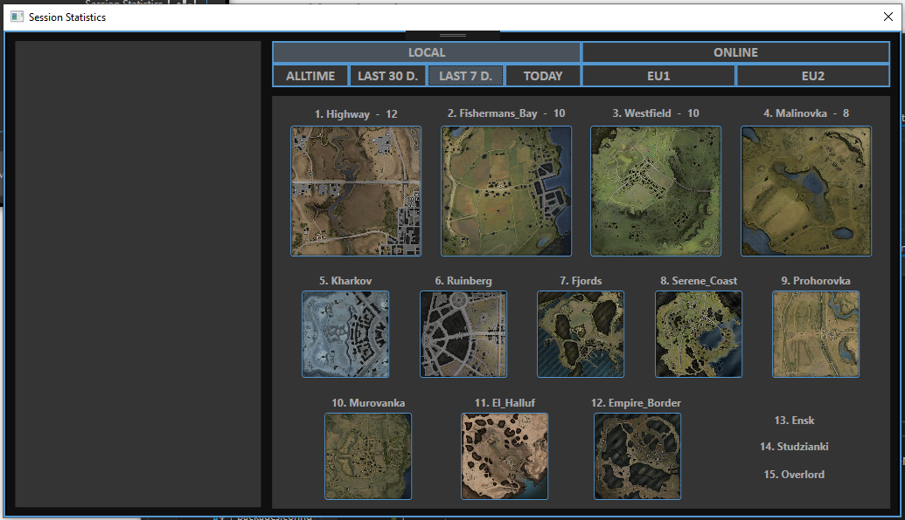
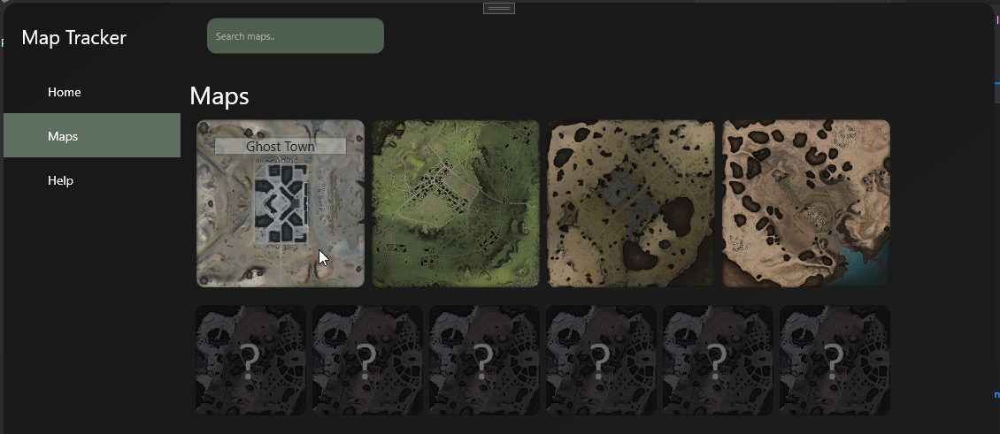
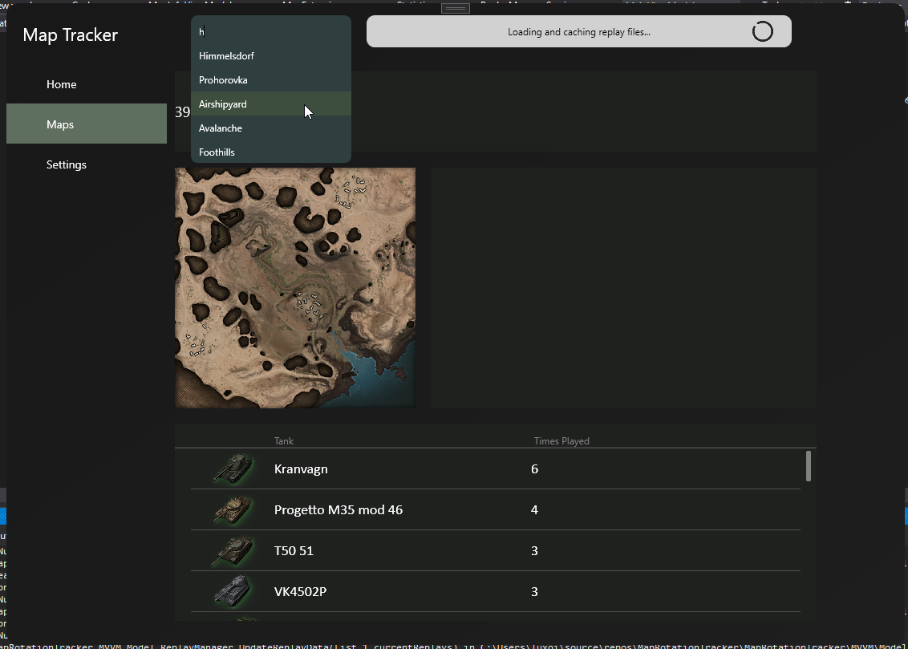
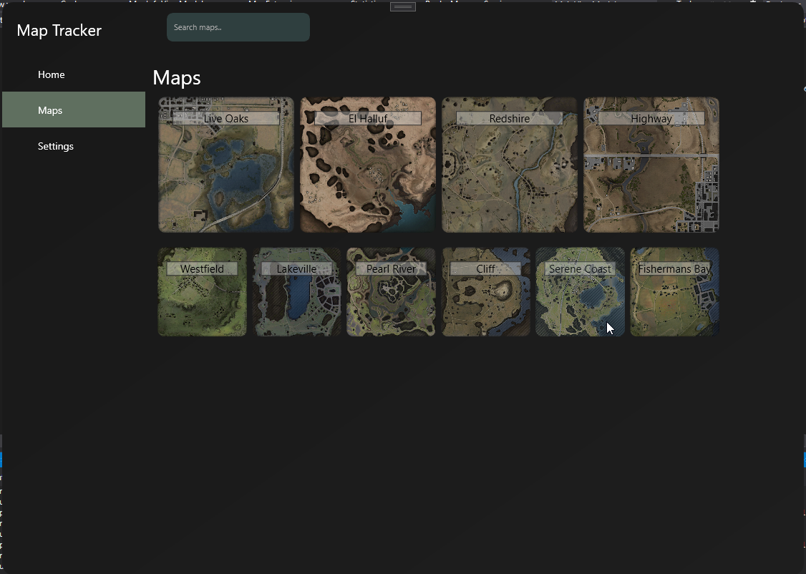

*DISCLAIMER*
I do not claim own or claim to own any of the game resources used in this project. All rights belong to Wargaming Group Limited.

# MapRotationTracker

Refactoring project for the original Rotation Tracker. Currently focusing on applying the best MVVM practices, keeping code clean and consistent.
Original source is currently private.

*Original description*

An external mod for World of Tanks.

World of Tanks servers run around 40 maps to be played in the game. The server chooses a map pool every x minutes (this value is unknown), which is why this program can exist. It logs all battles that are played while the mod is running on the PC, uploads them onto google cloud database services, and makes sure that all items in the database are up to date (ideally not older than 20 minutes, lesser the number - more accurate the results - more people needed).

All recent match count and their server ID are brought back to the WPF app (the client) where they are displayed.

Old project:

New project (Work in progress):

26/08/2021 Update:

